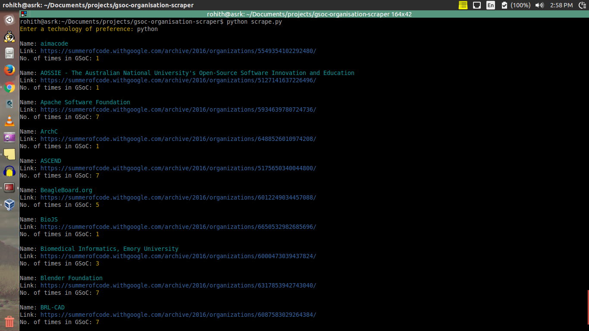
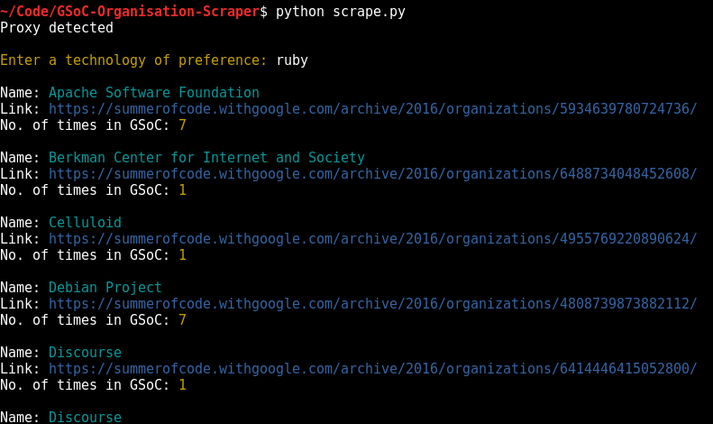

# GSoC '16 organisation scraper

Makes life easier by scraping instead of searching for each and every organisation by name. Also shows number of times that an organisation has appeared in GSoC.
Used [Requests](http://docs.python-requests.org/en/master/) library of python and [BeautifulSoup](https://www.crummy.com/software/BeautifulSoup/bs4/doc/)

### Requirements :
+ BeautifulSoup
+ Requests

### Instructions :
+ `git clone https://github.com/rohithasrk/gsoc-organisation-scraper.git`
+ `[sudo] pip install -r requirements.txt`
+ `python scrape.py`
+  Enter the technology of preference when prompted.

### Screenshots :

When browsed for python, some of the results are as shown below.

### TODOs :
+ Make the code run faster.
+ Making it look better.
+ Remove multiple results.
+ Change the default colors.

### Contributing :
+ Fork the repo.
+ Create a new branch named `<your_feature>`
+ Commit changes and make a PR.
+ PRs are welcome.

